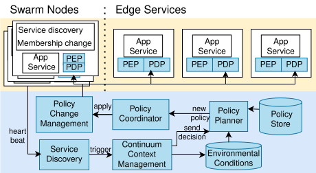

# SAGELY - A Framework for Swarm-Edge Policy Coordination and Optimization


SAGELY is a framework for context-aware, holistic service policy enforcement across the swarm-edge continuum. It enables the definition and enforcement of policies for services running on drones and edge servers, taking into account the dynamic context of the swarm.


=======
- Using this framework to extend further:
  - A swarm-edge-cloud continuum service-based application (SESA)
  - Policy-oriented development, such as policy generation and policy conflict resolution
  - UAV swarm coordination along with monitoring

## Components and  Features

SAGELY includes:

- **[Swarm Simulation](./swarm_simulation/)**: We utilize the Software-In-The-Loop (SITL) simulator concept to simulate a swarm of drones using [Gazebo](https://github.com/gazebosim/gz-sim), [PX4](https://github.com/PX4/PX4-Autopilot), and Robot Operating System (ROS) version 2 Jazzy. It allows for the creation of a network of drones, each with its own set of services.
  - **Swarm Generation Utility**: The `swarm_simulation/generation_drones` directory contains a utility to automatically generate configurations for a swarm of drones. By editing the `input_config.yml` file, you can specify the number of drones, their IP addresses, and other parameters. The `generation_drones.py` script will then generate the necessary `docker-compose` files to launch the swarm.
  - >TODO: Decouple etcd consensus and ros2-based application

- **[SAGELY Framework](./src/sagely/)**: responsible for policy management and enforcement. It consists of the following services:
    - **Service Discovery**: Keeps track of the heartbeat of all drones and stores their information in the Context Management service to decide the crash-failure detection if the long silence happens.

    - **Context Management**: A duckDB-based database that continuously stores status and interacts with the drones to maintain their context or status of the tasks which also support to deliver the current progress to incoming drones.
    - **Policy Controlplane**:
        - **Policy Planner**: Creates policies to satisfy the changes from the Context Management service.
        - **Policy Coordinator**: Decides on the devices/containers to which the policies should be applied.
        - **Policy Change Management**: Sends and applies policies to the OPA (Open Policy Agent) instances running on the drones and edge servers.
        - >TODO: Connection among policy_controlplane services not yet finished
     
- **[Applications](./applications/object_classification)**: An example application that demonstrates the use of the SAGELY framework. It includes the necessary infrastructure to set up an edge cluster.


## SAGELY Deployment 
### Prerequisites

- [Docker](https.docs.docker.com/get-docker/)
- [Kind](https://kind.sigs.k8s.io/docs/user/quick-start/#installation)
- [istioctl](https://istio.io/latest/docs/setup/additional-setup/download-istio-release/)
- [Tilt](https://docs.tilt.dev/install.html)
- [kubectl](https://kubernetes.io/docs/tasks/tools/install-kubectl/)
- [Python](https://www.python.org/downloads/)

### Application 
  Let use our example [object_classification](https://github.com/rdsea/object_classification_v2.git), but you may need to take a look on the README of the application to create `onnx_model` and copy to the `applications/object_classification/src/inference/`
  ```bash
  cd applications
  git clone -b drone_app https://github.com/rdsea/object_classification_v2.git object_classification
  ```

### SAGELY Edge Cluster
- K8s deploy and (basic deployment)
  **Create the edge cluster and deploy the application:**


### Deployments

There are two ways to set up the environment:

#### For a full-fledged experiment (recommended):

   This method uses `kind` to create a Kubernetes cluster and then deploys the application.

   ```bash
   kind create cluster --config ./infrastructure/kind-config.yaml
   ./infrastructure/deploy_istio.sh
   cd ./applications/object_classification/deployment/edge/
   ./apply.sh
   ```

#### For a quick local setup:

   This method uses `Tilt` to both create the edge cluster and deploy the application.

   ```bash
   cd infrastructure
   minikube start 
   tilt up
   ```


## Scenarios

### Reproduce the ICWS 2025 Experiment

To reproduce the experiment from our ICWS 2025 paper, navigate to the `experiments/ICWS2025` directory and run the `run_all_experiment.sh` script:

```bash
cd experiments/ICWS2025
./run_all_experiment.sh
```

This will create a new directory named `resultX` (where X is a number) and store the CSV results of the experiment in it.

## Advanced Usage

### Creating Swarm Simulation

1. **Build the drone container:**

   Build a docker-based container for ROS2-based drones. You can also use the pre-built image `hongtringuyen/client_drone_ros2_px4`.

   ```bash
   cd swarm_simulation/
   docker build -t hongtringuyen/client_drone_ros2_px4 -f Dockerfile .
   ```

2. **Create a network of drones:**
  
   - **Create env and install requirements:** 
     ```bash
     uv init  # OR rye init and rye sync
     uv sync
     ```

   - **Configure the swarm:** Fill in the configuration file `swarm_simulation/generation_drones/input_config.yml`.
   - **Generate the drone configurations:**

     ```bash
     cd ./swarm_simulation/generation_drones/
     python generation_drones.py input_config.yml
     ```
     The `outputs/` contains:
     - `dockercompose_config` folder in which contains the docker compose files for each drone 
     - `envoy_config` folder in which contains the envoy configuration files for each drone
     - `tmuxinator_config` folder in which contains the tmuxinator configuration files for each drone

   - **Run the drones:**

     ```bash
     docker compose -f ./swarm_simulation/generation_drones/outputs/dockercompose_config/docker-compose-drone_XXX.yml up -d
     ```

     Replace `XXX` with the ID of the drone.

     **Note:** It is crucial to ensure that the drone ID (`XXX`) is consistent across all configuration files, including `swarm_simulation/config/client_config.yaml` and any policy files (e.g., `policy.rego`).

3. **Simulate Gazebo environment:**

   If you want to simulate a Gazebo environment, run the following command:

   ```bash
   python ./simulation-gazebo/scripts/simulation-gazebo --gz_partition relay --gz_ip 192.168.132.1 --world drones_world
   ```

### Policy Management

- **Change policy for services in the cluster:**

  ```bash
  cd src/sagely/policy_controlplane/policy_change_management/
  python src/apply_policy_cluster.py <rego_policy_path>
  ```
  - Here, we provide an example `policy_change_management/policy/policy_cluster.rego`

- **Change policy for the drones:**

  ```bash
  cd src/sagely/policy_controlplane/policy_change_management/
  python src/send_FTP_px4.py \
    --file-policy <rego_policy_path>  \
    --uav <UAV_name> udpout:<UAV_IP>:14560 udp:0.0.0.0:14551 \
    --runs <Number_of_runs>
  ```
  - Here, we provide two basic example `policy_change_management/policy/policy_drone_allow.rego` and `policy_change_management/policy/policy_drone_deny.rego`

### Some Basic Tests/Checks for the Deployments
- If you look carefully from `src/sagely/k8s_deployment/istio-opa/opa_config.yml`, after the deployment, only username from header called `alice` or `bob` or `charlie` can have some basic permisison. Therefore, most requests coming to the `minikube` are rejected.
    ```bash
    # Define user-role mapping
    user_roles = {
      "alice": ["guest"],
      "bob": ["admin"],
      "charlie": ["user"],
    }
    ```
- To enable the permission with current service, especially the current application, called `object_classification_v2`, we need to execute the command from [Policy Management](#policy-management) for the cluster

- Visualize the Errors/Success via Jaeger UI
  ```bash
  http://<IP_cluster>/jaeger
  # Eg. http://192.168.49.2/jaeger
  ```

### Troubleshooting

- **500 error codes:** These errors are usually related to missing timestamps in the request headers. Carefully check the headers of your requests.
- **403 error codes:** These errors are related to authorization. Check if the ID fits with the rego policies.

## References

- [SAGELY - Context-aware Holistic Service Policy Enforcement across Swarm-Edge Continuum](https://research.aalto.fi/files/183265011/Dynamic_policy_ICWS_10-3.pdf), IEEE ICWS 2025, [Slides](doc/20250711-ICWS-hong3nguyen-presentation.pdf)


If you use SAGELY in your research, please cite our paper:

```bibtex
@INPROCEEDINGS{nguyen_2025_sagely,
  author={Nguyen, Hong-Tri and Yuan, Liang and Nguyen, Anh-Dung and Babar, M. Ali and Truong, Hong-Linh},
  booktitle={2025 IEEE International Conference on Web Services (ICWS)}, 
  title={SAGELY - Context-Aware Holistic Service Policy Enforcement Across Swarm-Edge Continuum}, 
  year={2025},
  pages={607-617},
  doi={10.1109/ICWS67624.2025.00083}}
```
